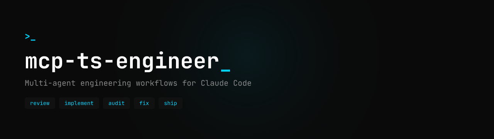

<div align="center">
  
</div>

[](LICENSE)

## Overview

**mcp-ts-engineer** provides AI-powered software development capabilities via the [Model Context Protocol (MCP)](https://modelcontextprotocol.io/). It integrates the [Claude Agent SDK](https://github.com/anthropics/claude-agent-sdk) to coordinate specialized agents (reviewer, implementer, auditor, finalizer) for feature development with proper planning, TDD execution, and quality gates.

When added as a git submodule, it provides:
- **MCP tools**: `todo_reviewer`, `todo_code_writer`, `finalize`, `audit_fix`, `pr_reviewer`, `pr_fixer`
- **Claude Code commands**: 12 commands including `/create-app`, `/worktree-add`, `/issue-capture`, `/issue-implement`, `/issue-shape`, `/health-check`, `/deep-review`, `/doc-audit`, `/prompt-engineer`
- **Claude Code skills**: 52+ reusable skills (NestJS, React Native, Expo, Next.js, TypeScript, etc.)
- **Claude Code rules**: Coding style, git workflow, testing, security, performance
- **Bootstrap script**: Scaffolds entire monorepo + Claude Code environment in one command

## Prerequisites

- **Node.js** >= 22.0.0
- **npm** (with workspaces support)
- **Claude Code CLI** — [install](https://code.claude.com/docs/en/overview) and authenticate with `claude login`
- **GitHub CLI** (`gh`) — required for PR review and issue management tools

> **Note**: Some app templates (`expo-app`, `nestjs-server`, `mcp-server`) currently pin Node 24 in their `.nvmrc`. If you scaffold these, use Node 24 to avoid `EBADENGINE` warnings.

**Bootstrap installs (auto)**: Bootstrap will additionally install (if missing): **Bun** runtime (via curl-pipe-bash from bun.sh, also appends PATH to `~/.zprofile`), **mcpmon** (global npm install for hot-reload).

## Quick Start

```bash
# 1. Create repo
mkdir my-project && cd my-project
git init

# 2. Add submodule
git submodule add https://github.com/ltomaszewski/mcp-ts-engineer.git packages/mcp-ts-engineer

# 3. Run bootstrap (scaffolds everything)
bash packages/mcp-ts-engineer/scripts/bootstrap.sh

# 4. Commit
git add -A && git commit -m "chore: initial monorepo setup"
```

> Review staged files with `git status` first — `.claude/settings.local.json` may be present and is typically gitignored.

## Architecture

```
your-monorepo/
├── packages/mcp-ts-engineer/     ← git submodule
│   ├── src/capabilities/         ← MCP tool implementations
│   ├── .claude/commands/         ← command source files
│   ├── .claude/skills/           ← 52+ skill directories
│   ├── .claude/rules/            ← coding guidelines
│   ├── scripts/                  ← bootstrap, create-app, update scripts
│   └── templates/
│       ├── config/               ← monorepo root config templates
│       └── apps/                 ← app scaffold templates
├── .claude/commands/             → symlinks to submodule
├── .claude/skills/               → symlinks to submodule
├── .claude/rules/                → symlinks to submodule
├── .mcp.json                     ← generated (MCP server config)
├── ts-engineer.config.json       ← generated (server settings)
└── CLAUDE.md                     ← generated (project instructions)
```

The MCP server key is always `ts-engineer` — tools are invoked as `mcp__ts-engineer__*`.

## What Bootstrap Does

The bootstrap script auto-detects project name, repo owner/name, and discovered workspaces. It generates:

- **Root monorepo files**: `package.json` (turbo + npm workspaces), `turbo.json`, `tsconfig.json`, `vitest.config.ts`, `biome.json`, `.gitignore`
- **MCP configuration**: `.mcp.json` (server registration), `ts-engineer.config.json` (server settings)
- **Claude Code environment**: `CLAUDE.md`, symlinked commands/skills/rules
- **Claude Code permissions**: writes `.claude/settings.local.json` with MCP tool permissions
- **Additional symlinks**: `.claude/{contexts,hooks,knowledge-base,agents}` directories
- **Project infrastructure**: `.claude/codemaps/` (per project), `docs/specs/` (spec directories)
- **GitHub labels**: runs `setup-issue-labels.sh` to create issue labels (when `gh` is authenticated)
- **Global tooling**: installs **Bun** and **mcpmon** globally if missing; appends Bun PATH lines to `~/.zprofile`
- **Submodule build**: `npm install && npm run build` in the submodule

**Idempotency**: Config files are skipped if they exist. `.mcp.json` is merged (adds entry without overwriting). Symlinks are skipped if present. Safe to run multiple times.

**Arguments** (all optional — auto-detected by default):
```
--repo-owner "org"     GitHub org (override auto-detection)
--repo-name "repo"     GitHub repo name (override auto-detection)
```

## Creating Apps

Scaffold new apps inside `apps/` from built-in templates:

```bash
# CLI
bash packages/mcp-ts-engineer/scripts/create-app.sh \
  --type <app-type> --name <app-name> [--port <port>]

# Claude Code command (interactive)
/create-app expo-app my-mobile
/create-app nestjs-server my-api --port 3002
/create-app mcp-server my-agent
/create-app next-app my-web
```

### Available App Types

| Type | Label | Test Runner | Key Stack |
|------|-------|-------------|-----------|
| `expo-app` | React Native (Expo) | Jest (`jest-expo`) | Expo SDK 55, NativeWind v5, Expo Router, Zustand, TanStack Query |
| `nestjs-server` | NestJS Backend | Vitest (`unplugin-swc`) | NestJS v11, GraphQL (Yoga), MongoDB (Mongoose), JWT auth |
| `mcp-server` | MCP Server | Vitest | Claude Agent SDK, MCP SDK, ESM, Zod |
| `next-app` | Next.js Web App | Vitest (`jsdom`) | Next.js 15, React 19, TanStack Query, Better Auth, shadcn/ui, Tailwind v4 |

### What It Creates

```
apps/<name>/
├── package.json          # Deps and scripts (workspace-aware)
├── tsconfig.json         # TypeScript config
├── biome.json            # Biome config (inherits root rules)
├── [test config]         # jest.config.js or vitest.config.ts
├── src/                  # Source code with starter files
└── ...                   # Type-specific config files
```

The script also:
1. Creates `docs/specs/<name>/todo/` for spec-driven development
2. Runs `npm install` to register the new workspace
3. Runs `update.sh` to regenerate codemaps and symlinks

### Adding a New App Type

The template system is fully registry-driven — **no script changes needed**:

1. Create `templates/apps/<type>/src` directory
2. Add entry to `templates/apps/registry.json`
3. Add template files with `.template` suffix using `{{PLACEHOLDER}}` markers
4. Special naming: `swcrc.template` → `.swcrc`, `env.example.template` → `.env.example`

## Available MCP Tools

| Tool | Purpose |
|------|---------|
| `todo_reviewer` | Review and validate spec files (TDD validation, structure check) |
| `todo_code_writer` | TDD implementation from spec (multi-phase: eng → audit → commit) |
| `finalize` | Post-implementation: audit, test, codemap update, commit |
| `audit_fix` | Fix lint, type, test, and dependency violations |
| `pr_reviewer` | Comprehensive PR review with auto-fix capabilities |
| `pr_fixer` | Resolve `pr_reviewer` findings via two-tier fix strategy (mechanical fixes + spec pipeline); posts per-issue status to PR comment |
| `echo_agent` | Test agent connectivity (proof-of-concept) |

### Spec-Driven Workflow

```
todo_reviewer          DRAFT → IN_REVIEW
    ↓
todo_code_writer       IN_REVIEW → READY
    ↓
finalize               READY → IMPLEMENTED
```

## Available Commands

| Command | Purpose |
|---------|---------|
| `/create-app [type] [name]` | Scaffold a new app from a template |
| `/worktree-add <purpose>` | Create isolated git worktree (auto-cleans merged ones) |
| `/issue-capture` | Capture session context as a structured GitHub issue |
| `/issue-implement <number>` | End-to-end: import → worktree → review → implement → finalize → PR |
| `/issue-to-todo <number>` | Import GitHub issue to a local spec file (no implementation) |
| `/issue-shape` | Shape a rough idea into implementation-ready GitHub issues with dependencies |
| `/doc-audit <path>` | Multi-specialist documentation audit and rewrite |
| `/health-check` | Autonomous monorepo audit + auto-fix + PR review pipeline |
| `/deep-review <prompt>` | Multi-perspective agent-team review of any change, design, or decision |
| `/skills-rn` | Load all React Native and Expo skills into context |
| `/prompt-engineer` | Author prompts, skills, commands, and agents using Anthropic best practices |
| `/update-skills` | Sync skill knowledge bases to template-system versions |

## Available Skills

52+ specialized skills, auto-loaded based on task context. Grouped by domain:

**Backend**: `nestjs-core`, `nestjs-auth`, `nestjs-graphql`, `nestjs-mongoose`

**Frontend (Web)**: `nextjs-core`, `nextjs-seo`, `nextjs-testing`, `shadcn-ui`, `tailwind-v4`, `better-auth`, `lucide-react`, `next-themes`, `sonner`

**Mobile (React Native / Expo)**: `react-native-core`, `expo-core`, `expo-router`, `expo-notifications`, `reanimated`, `gesture-handler`, `keyboard-controller`, `nativewind`, `flash-list`, `rn-screens`, `safe-area-context`, `react-hook-form`, `maestro`

**State & Data**: `react-query`, `zustand`, `mmkv`, `graphql-request`

**Validation & Quality**: `zod`, `class-validator`, `biome`, `typescript-clean-code`, `rn-testing-library`, `patterns`

**AI & Engineering**: `ai-engineering`, `claude-agent-sdk`, `anthropic-prompt-engineering`, `mcp-sdk`, `agent-browser`

**Utilities**: `date-fns`, `netinfo`, `sentry-react-native`, `graphql-curl-testing`

**Workflow**: `codemap-updater`, `session-manager`, `continuous-learning`, `design-system`, `doc-prd`, `hooks`

**Deployment**: `azure-deployment`

## For Collaborators

```bash
git clone --recurse-submodules https://github.com/your-org/your-project.git
cd your-project
npm install
bash packages/mcp-ts-engineer/scripts/update.sh   # sync codemaps + symlinks
```

## Updating the Submodule

```bash
cd packages/mcp-ts-engineer && git pull origin main && cd ../..
bash packages/mcp-ts-engineer/scripts/update.sh
git add -A && git commit -m "chore: update mcp-ts-engineer"
```

## Customization

| File | Purpose | Editable? |
|------|---------|-----------|
| `ts-engineer.config.json` | Server name, codemaps, review checklist | Yes |
| `.claude/codemaps/*.md` | Project-specific code maps | Yes |
| `docs/specs/*/todo/` | Spec files for documentation-driven development | Yes |
| `CLAUDE.md` | Project-wide Claude Code instructions | Yes |

## Monorepo Stack

- **Package manager**: npm with workspaces (`apps/*`, `packages/*`)
- **Build orchestration**: Turborepo
- **Testing**: Vitest (native TypeScript, zero-config monorepo discovery)
- **Linting/Formatting**: Biome (single Rust binary, replaces ESLint + Prettier)
- **Node.js**: >= 22.0.0

## Development

```bash
npm install          # Install dependencies
npm run build        # Build TypeScript
npm start            # Start MCP server
npm run dev          # Run server with tsx (single shot)
npm test             # Run tests
npm run test:watch   # Watch mode
npm run test:coverage # Coverage report
```

### Authentication

Uses **Claude Code CLI subscription authentication** — no API key required.

1. Install Claude Code CLI
2. Run `claude login`
3. Choose "Log in with subscription account"

The SDK automatically uses your authenticated CLI session.

### Configuration

All constants in `src/config/constants.ts`:

| Category | Examples |
|----------|----------|
| Budgets | `MAX_SESSION_BUDGET_USD` (10.0), `MAX_DAILY_BUDGET_USD` (500.0) |
| Sessions | `SESSION_MAX_DEPTH` (5), `MAX_SESSION_DURATION_MS` (45 min) |
| Security | `MAX_TURNS` (100), `MAX_PROMPT_LENGTH` (200k) |
| Logging | Log rotation, sensitive data redaction |

### CI/CD

```yaml
name: CI
on: [push, pull_request]
jobs:
  check:
    runs-on: ubuntu-latest
    steps:
      - uses: actions/checkout@v4
        with:
          submodules: recursive
      - uses: actions/setup-node@v4
        with:
          node-version: 22
          cache: npm
      - run: npm ci
      - run: npx turbo run build test lint format:check type-check
```

## Security

- Sensitive data redaction in all logs (API keys, tokens, bearer tokens)
- Input validation via Zod schemas on all capability inputs
- Budget enforcement at query, session, and daily levels
- Recursive call prevention via `BLOCKED_TOOLS`
- Shell command injection prevention via `execFileSync` (array-based arguments)
- Cost report files written with restricted permissions (0o600)
- HTTP MCP servers disabled by default

## License

[MIT](LICENSE)
